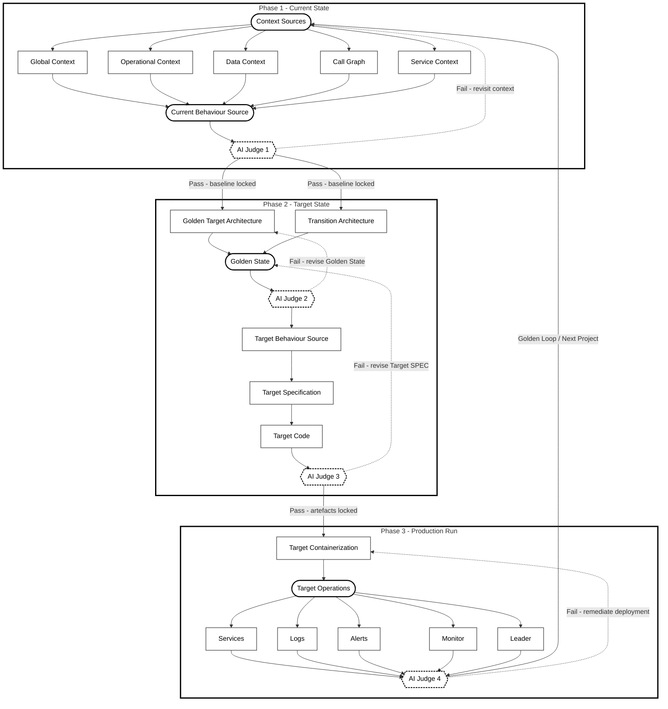

# Golden Thread — Software Modernization Methodology

## Introduction

The **Golden Thread** is a structured software modernization methodology that guides engineering
and architecture teams through a disciplined, repeatable process for transforming legacy systems
into modern, cloud-native, production-grade services.

The methodology is organized into **three sequential phases**:

1. **Current State** — Capture and characterize the system as it exists today
2. **Target State** — Derive and define what the modernized system should become
3. **Production Run** — Operationalize the target system into live production

Once a full cycle completes, the outputs of Phase 3 feed back into the start of Phase 1, forming
the **Golden Loop** — a closed, continuous modernization cycle that repeats for every subsequent
modernization project across the application estate. The Golden Thread is not a one-time
engagement; it is a perpetual operating model for sustained, disciplined modernization.

---

## Phase 1 — Current State

The Current State phase establishes a comprehensive, evidence-based understanding of the system
as it exists today. It is the authoritative foundation from which all Target State work is derived.
Phase 1 draws from two primary source categories: **Context Sources** and **Current Behaviour Source**.

### Context Sources

A multi-dimensional capture of the system's structural and operational environment:

- **Global Context**
  - Enterprise-wide architectural conventions, standards, and constraints
  - Landscape positioning of the application within the broader portfolio
  - Regulatory, compliance, and governance obligations

- **Operational Context**
  - How the system is currently deployed, operated, and maintained in production
  - Runbooks, on-call procedures, incident history, and SLA obligations
  - Infrastructure topology and environment configuration

- **Data Context**
  - Data models, schemas, and entity relationships
  - Data flows, ownership boundaries, and lineage
  - Stored procedures, triggers, and persistence mechanisms

- **Call Graph**
  - Static and dynamic call analysis mapping service-to-service invocations
  - Module-to-module and function-level dependency chains
  - Integration touchpoints with external systems and third-party APIs

- **Service Context**
  - Service boundaries, interfaces, and contracts
  - Internal and external dependencies
  - Published APIs and consumed services

### Current Behaviour Source

A behavioural specification of the system derived from the context sources:

- Documented domain logic and business rules as currently implemented
- Current State Behaviour artefacts recording *what* the system does, not just *how* it is built
- Meeting summaries and stakeholder knowledge capture
- Domain model, services, operations, stored procedures, tables, and behavioural observations

> **Phase 1 Output:** A fully characterised, evidence-based baseline — the definitive record of
> the system's current structure, behaviour, and operational footprint — which becomes the sole
> authoritative input to Phase 2.

---

## Phase 2 — Target State

The Target State phase is derived directly and exclusively from the Current State baseline
produced in Phase 1. It translates the current-state understanding into a coherent set of target
artefacts that define what the modernized system should look like, how it should behave, and how
it will be built.

### Target State Artefacts

- **Golden Target Architecture**
  - The canonical future-state architecture: service decomposition, technology choices,
    integration patterns, and non-functional requirements
  - Domain boundaries, API design, data ownership, and scalability decisions
  - Derived from Current State context; informed by enterprise standards and target principles

- **Transition Architecture**
  - Intermediate architectural state(s) bridging current to target
  - Migration sequencing, strangler-fig patterns, and coexistence strategies
  - Risk-sequenced delivery plan ensuring the system remains operational throughout transition
  - Reduced domain surface: operations reduced, stored procedures reduced to zero, tables reduced

- **Golden State**
  - The validated, agreed representation of the target system
  - The single source of truth for the target; all downstream artefacts are derived from it
  - Encapsulates domain, reduced services, reduced operations, and Target State Behaviour

- **Target Behaviour Source**
  - Behavioural specifications for the modernized system
  - Aligned to the Golden State and fully traceable back to Current Behaviour
  - Defines *what* the target system must do, independently of implementation

- **Target Specification (Target SPEC)**
  - Detailed technical specifications: APIs, data contracts, service interfaces
  - Non-functional requirements: performance envelopes, SLAs, security posture
  - The implementable contract between architecture intent and engineering delivery

- **Target Code**
  - The implementation of the target system
  - Authored or generated in strict conformance with the Target SPEC and Golden Target Architecture
  - Tested against the Target Behaviour Source to validate behavioural equivalence

> **Phase 2 Output:** A complete, implementation-ready target definition — architecture,
> behaviour, specification, and code — ready to be containerized and deployed in Phase 3.

---

## Phase 3 — Production Run

The Production Run phase operationalizes the Target State. It takes the target artefacts produced
in Phase 2 through containerization and into live, governed production operation.

### Target Containerization

- Packaging Target Code into reproducible container images
- Defining orchestration manifests (e.g. Kubernetes Deployments, Services, ConfigMaps)
- Infrastructure-as-code for environment provisioning and configuration management
- Container security scanning, image signing, and registry governance

### Target Operations (Production Run)

The operational regime for the modernized system in live production:

- **Services** — Running, scaled containerized workloads serving production traffic
- **Logs** — Structured, centralised log aggregation and retention
- **Alerts** — Threshold-based and anomaly-driven alerting with defined escalation paths
- **Monitor** — Observability dashboards, distributed tracing, and health indicators
- **Leader** — Operational ownership, on-call governance, and incident command structure

> **Phase 3 Output:** A live, observable, governed production system — and a body of operational
> learnings and updated context that seeds the next iteration of the Golden Loop.

---

## The Golden Loop

> The Golden Loop is a closed, iterative cycle:
> **Current → Target → Production Run → (feedback) → Current**.
> Each completed modernization run produces operational learnings and an updated baseline that
> becomes the *Current Context Source* for the next iteration. When a new modernization project
> begins, it enters the loop at the Current State phase, reusing the established
> context-capture, target-derivation, and production-run stages. The loop never terminates —
> it is the mechanism for continuous modernization across the application estate.

Each completed iteration of the Golden Loop:

1. Produces a richer, more accurate Current State baseline drawn from live production telemetry
2. Enables more precise Target State derivation, informed by real operational data
3. Tightens the feedback cycle between architecture intent and production reality
4. Progressively reduces modernization risk as institutional knowledge accumulates within the loop
5. Extends coverage across the application estate — one service, one domain, one loop at a time

The Golden Loop transforms modernization from a bounded project into a **continuous
organisational capability**.

---

## AI Judge — Inner Validation Loops

At every phase transition within the Golden Thread, an **AI Judge** acts as an automated quality
gate. The AI Judge evaluates the artefacts produced by each phase against a defined set of
correctness, completeness, and behavioural equivalence criteria before allowing progression to the
next phase. If validation fails, the AI Judge triggers an **inner loop** — returning the work to
the start of the current phase for refinement — rather than propagating defects forward.

These inner loops are distinct from the outer Golden Loop: they operate *within* a single
modernization cycle and are invisible to the outer iteration unless a phase is formally re-entered.

### Inner Loop 1 — Current State Validation

- **Trigger:** AI Judge evaluates the Current Behaviour Source against the Context Sources
- **Validates:**
  - Completeness of context capture across all five context dimensions
  - Consistency between the Call Graph, Service Context, and documented behaviour
  - Absence of contradictions between data context and operational observations
- **On failure:** Returns to Context Sources for gap-filling, re-interview, or re-analysis
- **On pass:** Current State baseline is locked and passed to Phase 2

### Inner Loop 2 — Target State Validation

- **Trigger:** AI Judge evaluates Target State artefacts at two checkpoints:
  - After Golden State is derived from Golden Target Architecture and Transition Architecture
  - After Target Code is produced from Target Specification
- **Validates:**
  - Behavioural equivalence between Current Behaviour Source and Target Behaviour Source
  - Conformance of Target Code to Target Specification
  - Architectural consistency between Target Code and Golden Target Architecture
  - Reduction assertions: operations reduced, stored procedures eliminated, tables consolidated
- **On failure:** Returns to the failing artefact (Golden State or Target SPEC) for correction
- **On pass:** Target State artefact set is locked and passed to Phase 3

### Inner Loop 3 — Production Run Validation

- **Trigger:** AI Judge evaluates the live system post-deployment
- **Validates:**
  - Runtime behaviour of deployed services against Target Behaviour Source
  - Observability completeness: logs, alerts, and monitors meet defined thresholds
  - Operational readiness: on-call assignments, runbooks, and escalation paths are in place
- **On failure:** Returns to Target Containerization or Target Operations for remediation
- **On pass:** Production Run is ratified; operational learnings are captured and the Golden Loop
  feedback is initiated

> **Design principle:** The AI Judge does not gate on opinion — it gates on measurable,
> traceable criteria derived from the artefacts already produced within the Golden Thread.
> Every inner loop is evidence-driven and terminates only when the artefacts satisfy the
> criteria established at the start of that phase.

---

## Flow Diagram

---

*The Golden Thread — a continuous, closed-loop modernization methodology.*
*Every project strengthens the thread; every loop tightens the weave.*
