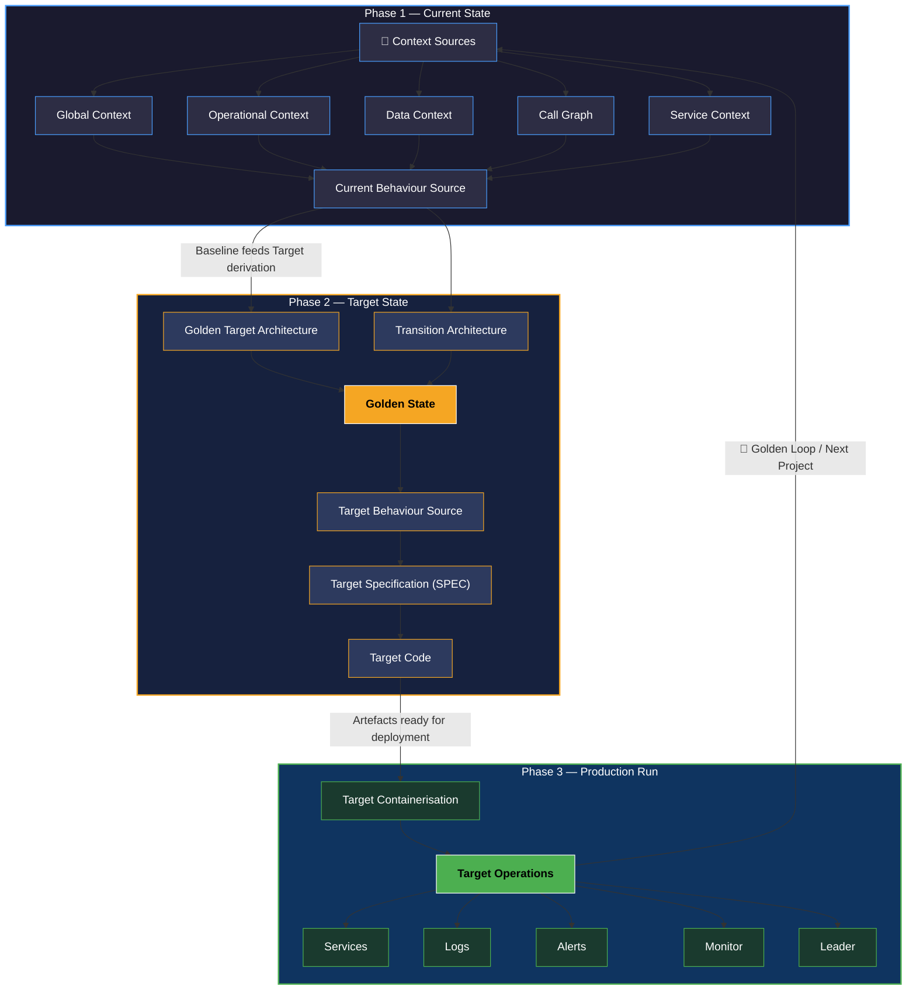

# Golden Thread — Software Modernization Methodology

## Introduction

The **Golden Thread** is a structured software modernization approach that guides engineering and architecture teams from understanding a system's current state through to a production-ready target state. It operates across **three sequential phases**: Current State, Target State, and Production Run.

Once a full cycle completes, the outputs of Production Run feed back into the start of the process, forming the **Golden Loop** — a closed, continuous modernization cycle that repeats for each new modernization project across the application estate. The Golden Thread is not a one-time engagement; it is a repeatable operating model for sustained, disciplined modernization.

---

## The Three Phases

---

## Phase 1 — Current State

The Current State phase establishes a comprehensive, structured understanding of the system as it exists today. It draws from two primary source categories:

### Context Sources

A multi-dimensional capture of the system's operating environment:

- **Global Context** — Enterprise-wide architectural conventions, standards, constraints, and landscape positioning of the application
- **Operational Context** — How the system is currently operated, deployed, monitored, and maintained in production
- **Data Context** — Data models, data flows, persistence mechanisms, stored procedures, and data ownership boundaries
- **Call Graph** — Static and dynamic call analysis mapping service-to-service, module-to-module, and function-level invocation chains
- **Service Context** — Service boundaries, interfaces, contracts, dependencies, and integration touchpoints

### Current Behaviour Source

A behavioural specification of the system derived from the context:

- Documented domain logic and business rules as currently implemented
- Meeting summaries and stakeholder knowledge capture
- Current State Behaviour artefacts that record *what* the system does, not just *how* it is built

> **Output of Phase 1:** A fully characterised, evidence-based baseline — the definitive record of the system's current structure, behaviour, and operational footprint — which becomes the authoritative input to Phase 2.

---

## Phase 2 — Target State

The Target State phase is derived directly from the Current State baseline. It translates the current-state understanding into a set of target artefacts that define what the modernised system should look like, how it should behave, and how it will be built.

### Target State Artefacts

- **Golden Target Architecture** — The canonical future-state architecture: service decomposition, technology choices, integration patterns, and non-functional requirements
- **Transition Architecture** — The intermediate architectural state(s) bridging current to target, including migration sequencing, strangler patterns, and coexistence strategies
- **Golden State** — The validated, agreed representation of the target system that all downstream artefacts are derived from; the single source of truth for the target
- **Target Behaviour Source** — Behavioural specifications for the modernised system, aligned to the Golden State and traceable back to Current Behaviour
- **Target Specification (Target SPEC)** — Detailed technical specifications: APIs, data contracts, service interfaces, and operational requirements for the target system
- **Target Code** — The implementation of the target system, generated or authored in conformance with the Target SPEC and Golden Target Architecture

> **Output of Phase 2:** A complete, implementation-ready target definition — architecture, behaviour, specification, and code — ready for containerisation and production deployment.

---

## Phase 3 — Production Run

The Production Run phase operationalises the Target State, taking the target artefacts through containerisation and into live production operation.

### Production Run Artefacts

- **Target Containerisation** — Packaging the Target Code into container images; defining orchestration manifests (e.g. Kubernetes), environment configuration, and infrastructure-as-code
- **Target Operations (Production Run)** — The operational regime for the modernised system in production, encompassing:
  - Services — running containerised workloads
  - Logs — structured, centralised log aggregation
  - Alerts — threshold-based and anomaly-driven alerting
  - Monitor — dashboards and observability tooling
  - Leader — ownership, on-call, and operational governance

> **Output of Phase 3:** A live, observable, governed production system — and a body of operational learnings that seeds the next iteration of the Golden Loop.

---

## The Golden Loop

> The Golden Loop is a closed, iterative cycle: **Current → Target → Production Run → (feedback) → Current**. Each completed modernization run produces operational learnings and an updated baseline that becomes the *Current Context Source* for the next iteration. When a new modernization project begins, it enters the loop at the Current State phase, reusing the established context-capture, target-derivation, and production-run stages. The loop never terminates — it is the mechanism for continuous modernization across the application estate.

Each iteration of the loop:

1. Produces a richer, more accurate Current State baseline drawn from live production telemetry
2. Enables more precise Target State derivation, informed by real operational data
3. Tightens the feedback cycle between architecture intent and production reality
4. Progressively reduces modernization risk across the estate as institutional knowledge accumulates within the loop

The Golden Loop transforms modernization from a project into a **continuous organisational capability**.

---

## Flow Diagram

---

*The Golden Thread — a continuous, closed-loop modernization methodology. Every project strengthens the thread; every loop tightens the weave.*
